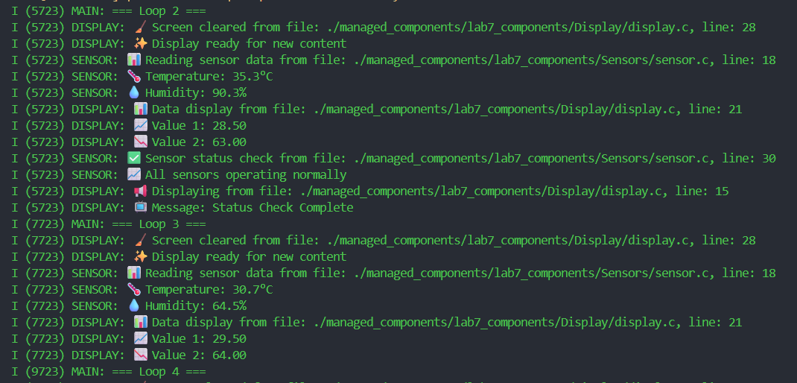

# Lab 7-2: Managed Component from GitHub URL Demo

## คำอธิบาย
การทดลองนี้แสดงการใช้งาน managed component จาก GitHub Repository
ใช้ `Sensors` component จาก https://github.com/APPLICATIONS-OF-MICROCONTROLLERS/Lab7_Components

## สรุปคำสั่งที่ใช้ และผลลัพธ์ที่ได้



คำสั่งใน lab7-1.c
``` c
#include <stdio.h>
#include "freertos/FreeRTOS.h"
#include "freertos/task.h"
#include "esp_system.h"
#include "esp_log.h"
#include "sensor.h"
#include "display.h"

static const char *TAG = "MAIN";

void app_main(void)
{
    ESP_LOGI(TAG, "🚀 Lab 6.2: Multiple Source Files Demo");
    ESP_LOGI(TAG, "📍 Main function from file: %s, line: %d", __FILE__, __LINE__);
    ESP_LOGI(TAG, "ESP-IDF Version: %s", esp_get_idf_version());
    
    // Initialize modules
    sensor_init();
    display_init();
    
    display_show_message("System Starting...");
    
    int counter = 0;
    
    while (1) {
        ESP_LOGI(TAG, "=== Loop %d ===", counter++);
        
        // Clear display every loop
        display_clear_screen();
        
        // Read sensor data
        sensor_read_data();
        
        // Show data on display
        float temp = 25.5 + (float)(counter % 10);
        float humid = 60.0 + (float)(counter % 20);
        display_show_data(temp, humid);
        
        // Check sensor status every 3 loops
        if (counter % 3 == 0) {
            sensor_check_status();
            display_show_message("Status Check Complete");
        }
        
        vTaskDelay(pdMS_TO_TICKS(2000)); // 2 seconds delay
    }
}
```