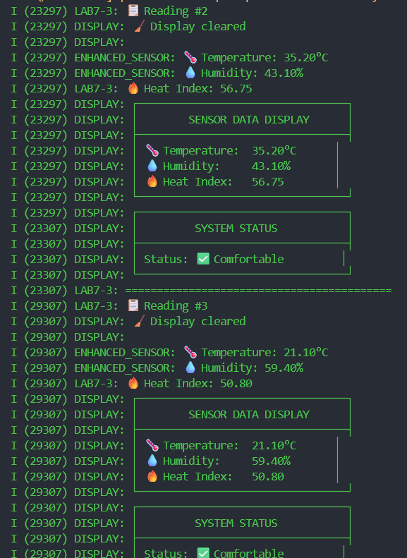

# Lab 7-3: Custom ESP32 Components (Sensor + Display)

## คำอธิบาย
การทดลองนี้แสดงการสร้าง component ใหม่ด้วยคำสั่ง `idf.py create-component`
สร้าง 2 components:
1. **Sensor Component** - อ่านค่า temperature, humidity และคำนวณ heat index
2. **Display Component** - แสดงผลข้อมูลในรูปแบบตาราง

## โครงสร้างโฟลเดอร์หลังใช้ create-component
lab7-3_esp32_Component/
├── CMakeLists.txt
├── components/
│   ├── sensor/
│   │   ├── CMakeLists.txt
│   │   ├── include/
│   │   │   └── sensor.h
│   │   └── sensor.c
│   └── display/
│       ├── CMakeLists.txt
│       ├── include/
│       │   └── display.h
│       └── display.c
├── main/
│   ├── CMakeLists.txt
│   └── lab7-3.c
├── build/
└── README.md

## สรุปคำสั่งที่ใช้ และผลลัพธ์ที่ได้



คำสั่งใน lab7-1.c

```c
#include <stdio.h>
#include "freertos/FreeRTOS.h"
#include "freertos/task.h"
#include "esp_log.h"
#include "sensor.h"
#include "display.h"

static const char *TAG = "LAB7-3";

void app_main(void)
{
    ESP_LOGI(TAG, "� Lab 7-3: Custom Components Demo (sensor + display) Started");
    ESP_LOGI(TAG, "📦 Using components created with idf.py create-component");
    
    // เริ่มต้น components
    sensor_init();
    display_init();
    
    int reading_count = 0;
    
    while(1) {
        reading_count++;
        ESP_LOGI(TAG, "📋 Reading #%d", reading_count);
        
        display_clear();
        
        // อ่านข้อมูลจาก sensor component
        float temp = sensor_read_temperature();
        float hum = sensor_read_humidity();
        
        // คำนวณ Heat Index
        float heat_index = temp + 0.5 * hum;
        ESP_LOGI(TAG, "🔥 Heat Index: %.2f", heat_index);
        
        // แสดงข้อมูลผ่าน display component
        display_show_sensor_data(temp, hum, heat_index);
        
        // แสดงสถานะตามค่า Heat Index
        if (heat_index < 80) {
            display_show_status("✅ Comfortable");
        } else if (heat_index < 90) {
            display_show_status("⚠️  Caution");
        } else {
            display_show_status("🚨 Warning");
        }
        
        ESP_LOGI(TAG, "==========================================");
        vTaskDelay(pdMS_TO_TICKS(6000));
    }
}
```